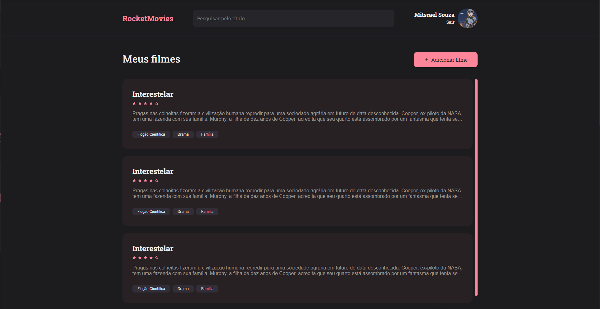
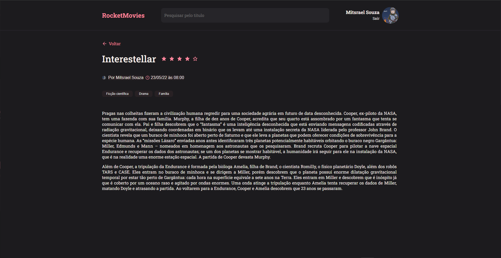
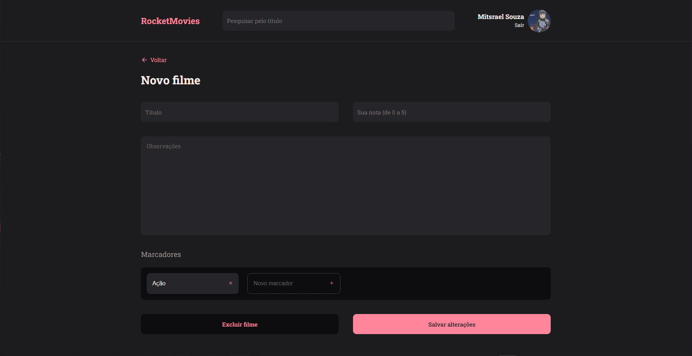
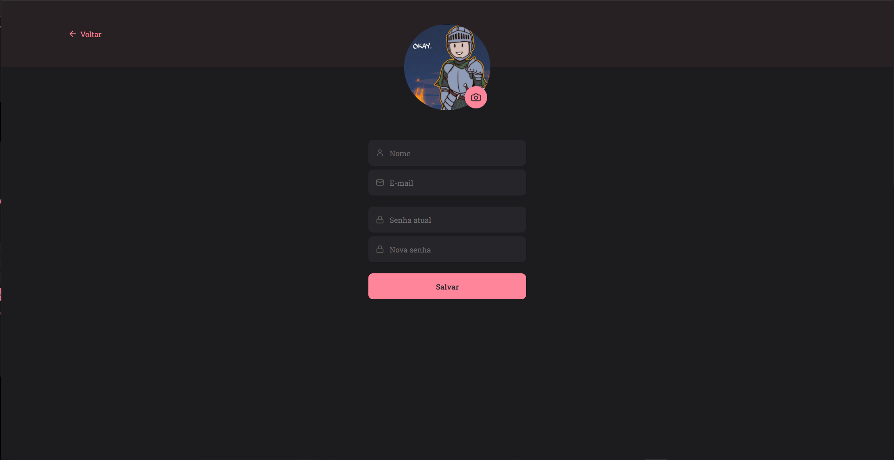
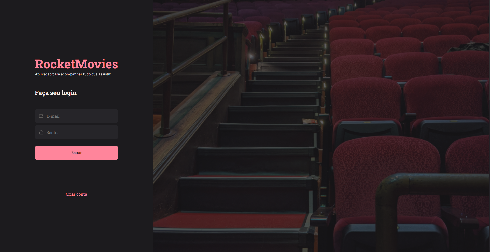
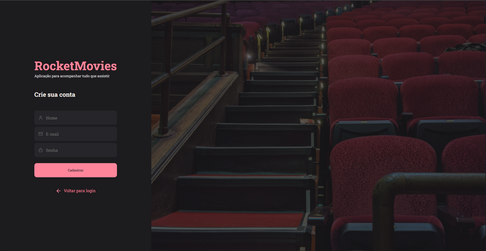

# RocketSeat - RocketMovies

RocketMovies é uma aplicação onde os usuários podem cadastrar filmes, preenchendo informações como nome, descrição, nota e criando tags relacionadas a eles.

## Tecnologias Utilizadas

-   **Vite**: Ferramenta de build rápida e moderna.
-   **React**: Biblioteca para construção de interfaces de usuário.
-   **react-dom**: Pacote que fornece métodos específicos do DOM que podem ser usados no nível superior da sua aplicação.
-   **react-icons**: Biblioteca de ícones para React.
-   **react-router-dom**: Biblioteca para gerenciamento de rotas em aplicações React.
-   **styled-components**: Biblioteca para estilização de componentes em React.

## Home

<div align="center">



</div>

## Estrutura de Rotas

### `app.routes.jsx`

```jsx
import { Routes, Route } from "react-router-dom"

import { Home } from "../pages/Home"
import { NewMovie } from "../pages/NewMovie"
import { Profile } from "../pages/Profile"
import { Details } from "../pages/Details"

export function AppRoutes() {
    return (
        <Routes>
            <Route path="/" element={<Home />} />
            <Route path="/newmovie" element={<NewMovie />} />
            <Route path="/profile" element={<Profile />} />
            <Route path="/details/:id" element={<Details />} />
        </Routes>
    )
}
```

### `auth.routes.jsx`

```jsx
import { Routes, Route } from "react-router-dom"

import { SignIn } from "../pages/SignIn"
import { SignUp } from "../pages/SignUp"

export function AuthRoutes() {
    return (
        <Routes>
            <Route path="/" element={<SignIn />} />
            <Route path="/register" element={<SignUp />} />
        </Routes>
    )
}
```

### `index.jsx`

```jsx
import { BrowserRouter } from "react-router-dom"

import { AppRoutes } from "./app.routes"
import { AuthRoutes } from "./auth.routes"

export function Routes() {
    return (
        <BrowserRouter>
            <AppRoutes />
        </BrowserRouter>
    )
}
```

### `main.jsx`

```jsx
import { StrictMode } from "react"
import { createRoot } from "react-dom/client"
import GlobalStyles from "./styles/global"
import { ThemeProvider } from "styled-components"

import { Routes } from "./routes"

import theme from "./styles/theme"

createRoot(document.getElementById("root")).render(
    <StrictMode>
        <ThemeProvider theme={theme}>
            <GlobalStyles />
            <Routes />
        </ThemeProvider>
    </StrictMode>
)
```

## Telas

<div align="center">

### Details



### New Movie



### Profile



### Sign-In



### Sign-Up



</div>

## Como Usar

### Instalação

1. Clone o repositório:

    ```bash
    git clone https://github.com/m-its/rocketmovies.git
    ```

2. Navegue até o diretório do projeto:

    ```bash
    cd rocketmovies
    ```

3. Instale as dependências:

    ```bash
    npm install
    ```

### Executando a Aplicação

1. Inicie o servidor de desenvolvimento:

    ```bash
    npm run dev
    ```

2. Abra o navegador e acesse `http://localhost:3000`.
